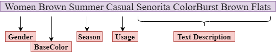

# E-commerce Prediction App 

**Application is available at https://e-comm-predict.herokuapp.com/**

**Successfully deployed an RNN based text model on heroku.**

Original files could be found here in this [repository](https://github.com/nmariya/e-commerce-classifier) 

We developed a front-end app using python Flask framework and deployed it as a service on the heroku cloud. This is to mimick a real life scenario, where  we productionalize the machine learning pipeline.

##### Example:

### Demo

![]
